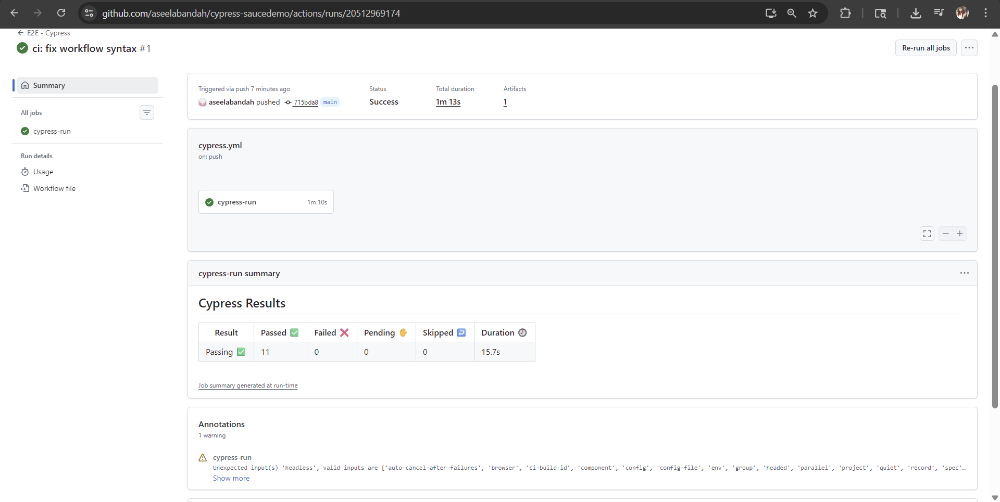
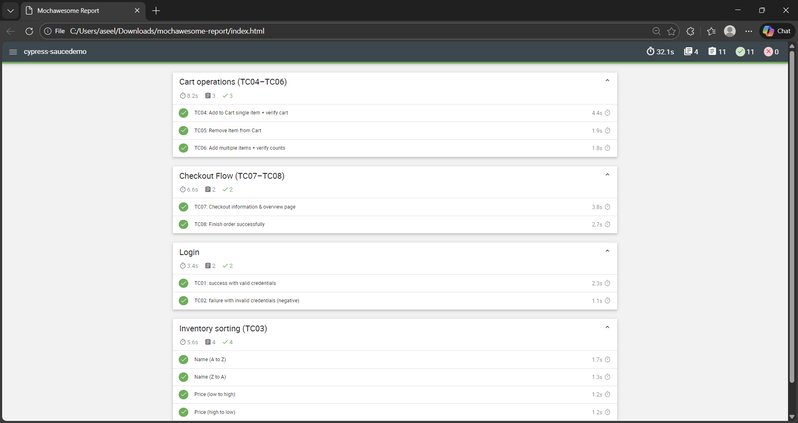

# Cypress Demo Automation – SauceDemo.com

[](https://github.com/aseelabandah/cypress-saucedemo/actions/workflows/cypress.yml)

##  Project Overview
This project is a Cypress end-to-end automation framework built to validate core e-commerce flows on the SauceDemo application.  
It is designed as a **portfolio project** to demonstrate real-world test automation practices, clean architecture, and CI integration.

**Application under test:** https://www.saucedemo.com  
**Testing type:** Web UI functional E2E testing  
**Scope:** Frontend only (no API or backend validation)

---

##  Test Coverage
- **TC01:** Login – success with valid credentials  
- **TC02:** Login – failure with invalid credentials  
- **TC03:** Inventory sorting  
  - Name (A → Z)  
  - Name (Z → A)  
  - Price (low → high)  
  - Price (high → low)  
- **TC04:** Add single item to cart and verify  
- **TC05:** Remove item from cart  
- **TC06:** Add multiple items and verify cart count  
- **TC07:** Checkout – information and overview validation  
- **TC08:** Checkout – finish order confirmation  

---

##  Framework & Architecture
```text
cypress/
├── e2e/          # Test specifications
├── pages/        # Page Object Model
├── fixtures/     # Test data
├── support/      # Custom commands & setup
```

---

## Tech Stack
- Cypress
- JavaScript (ES Modules)
- Node.js
- Git & GitHub
- GitHub Actions (CI)
- Mochawesome (HTML reporting)

---

## Continuous Integration (CI)
This project uses GitHub Actions to automatically run tests on every push to the `main` branch.

### CI Result


---

##  Test Report
After each CI run, a Mochawesome HTML report is generated automatically and uploaded as a workflow artifact.



---

##  Run the Project Locally

### Install dependencies
```bash
npm install
```
### Open Cypress Test Runner 
```bash
npx cypress open
 ```

### Run tests headlessly (CI-style)
```bash 
npm run test
npm run report
```

 The HTML report will be generated at:
```bash 
reports/html/index.html
```


